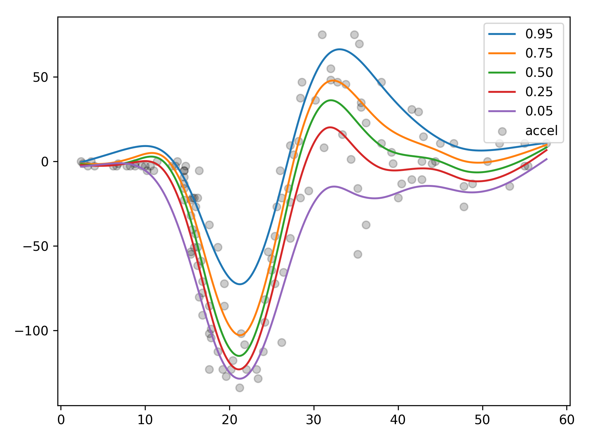

.. Expectile GAM class documentation

ExpectileGAM
============
::

  from pygam import ExpectileGAM
  from pygam.datasets import mcycle

  X, y = mcycle(return_X_y=True)

  # lets fit the mean model first by CV
  gam50 = ExpectileGAM(expectile=0.5).gridsearch(X, y)

  # and copy the smoothing to the other models
  lam = gam50.lam

  # now fit a few more models
  gam95 = ExpectileGAM(expectile=0.95, lam=lam).fit(X, y)
  gam75 = ExpectileGAM(expectile=0.75, lam=lam).fit(X, y)
  gam25 = ExpectileGAM(expectile=0.25, lam=lam).fit(X, y)
  gam05 = ExpectileGAM(expectile=0.05, lam=lam).fit(X, y)

::

  from matplotlib import pyplot as plt

  XX = gam50.generate_X_grid(term=0, n=500)

  plt.scatter(X, y, c='k', alpha=0.2)
  plt.plot(XX, gam95.predict(XX), label='0.95')
  plt.plot(XX, gam75.predict(XX), label='0.75')
  plt.plot(XX, gam50.predict(XX), label='0.50')
  plt.plot(XX, gam25.predict(XX), label='0.25')
  plt.plot(XX, gam05.predict(XX), label='0.05')
  plt.legend()

.. autoclass:: pygam.pygam.ExpectileGAM
    :members:
    :inherited-members:
    :undoc-members:
    :show-inheritance:
