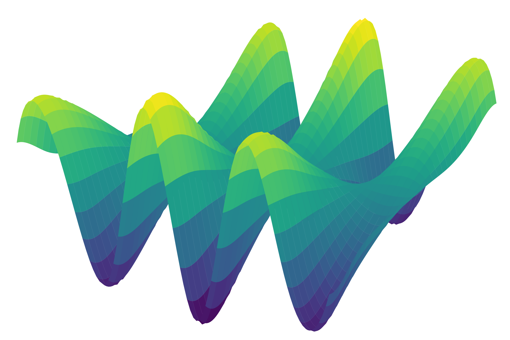

.. pyGAM documentation master file, created by
   sphinx-quickstart on Sat Aug 18 15:42:53 2018.
   You can adapt this file completely to your liking, but it should at least
   contain the root `toctree` directive.

Welcome to pyGAM's documentation!
=================================

|Build Status| |Documentation Status| |Coverage| |PyPi Version| |Py27| |Py36| |Zenodo| |Open Source|

pyGAM is a package for building Generalized Additive Models in Python,
with an emphasis on modularity and performance. The API will be immediately familiar to anyone with experience
of scikit-learn or scipy.

Installation
============

pyGAM is on pypi, and can be installed using ``pip``: ::

  pip install pygam

Or via ``conda-forge``, however this is typically less up-to-date: ::

  conda install -c conda-forge pyGAM

You can install the bleeding edge from github using ``flit``.
First clone the repo, ``cd`` into the main directory and do: ::

  pip install flit
  flit install

Optional
"""""""""
To speed up optimization on large models with constraints, it helps to
have ``scikit-sparse`` installed because it contains a slightly faster,
sparse version of Cholesky factorization. The import from
``scikit-sparse`` references ``nose``, so you'll need that too.

The easiest way is to use Conda: ::

  conda install -c conda-forge scikit-sparse nose

More information is available in the `scikit-sparse docs
<http://pythonhosted.org/scikit-sparse/overview.html#download>`_.

Dependencies
=============
pyGAM is tested on Python 2.7 and 3.6 and depends on ``NumPy``, ``SciPy``, and ``progressbar2`` (see ``requirements.txt`` for version information).

Optional: ``scikit-sparse``.

In addtion to the above dependencies, the ``datasets`` submodule relies on ``Pandas``.

Citing pyGAM
============

  Servén D., Brummitt C. (2018). pyGAM: Generalized Additive Models in Python. Zenodo. `DOI: 10.5281/zenodo.1208723 <http://doi.org/10.5281/zenodo.1208723>`_

Contact
=======
To report an issue with pyGAM please use the `issue tracker <https://github.com/dswah/pyGAM/issues>`_.

License
=======
GNU General Public License v3.0

Getting Started
===============
If you're new to pyGAM, read :ref:`the Tour of pyGAM </notebooks/tour_of_pygam.ipynb>`
for an introduction to the package.

.. toctree::
    :maxdepth: 2
    :caption: Contents:

    notebooks/quick_start.ipynb
    notebooks/tour_of_pygam.ipynb
    api/api
    dev-api/api

Indices and tables
==================
* :ref:`genindex`
* :ref:`modindex`
* :ref:`search`

.. |Build Status| image:: https://travis-ci.org/dswah/pyGAM.svg?branch=master
   :target: https://travis-ci.org/dswah/pyGAM
.. |Documentation Status| image:: https://readthedocs.org/projects/pygam/badge/?version=latest
   :target: https://pygam.readthedocs.io/en/latest/?badge=latest
.. |Coverage| image:: https://codecov.io/gh/dswah/pygam/branch/master/graph/badge.svg
   :target: https://codecov.io/gh/dswah/pygam
.. |PyPi Version| image:: https://badge.fury.io/py/pygam.svg
   :target: https://badge.fury.io/py/pygam
.. |Py27| image:: https://img.shields.io/badge/python-2.7-blue.svg
   :target: https://badge.fury.io/py/pygam
.. |Py36| image:: https://img.shields.io/badge/python-3.6-blue.svg
   :target: https://badge.fury.io/py/pygam
.. |Zenodo| image:: https://zenodo.org/badge/DOI/10.5281/zenodo.1208723.svg
   :target: https://doi.org/10.5281/zenodo.1208723
.. |Open Source| image:: https://img.shields.io/badge/powered%20by-Open%20Source-orange.svg?style=flat&colorA=E1523D&colorB=007D8A
   :target: https://github.com/dswah/pyGAM
